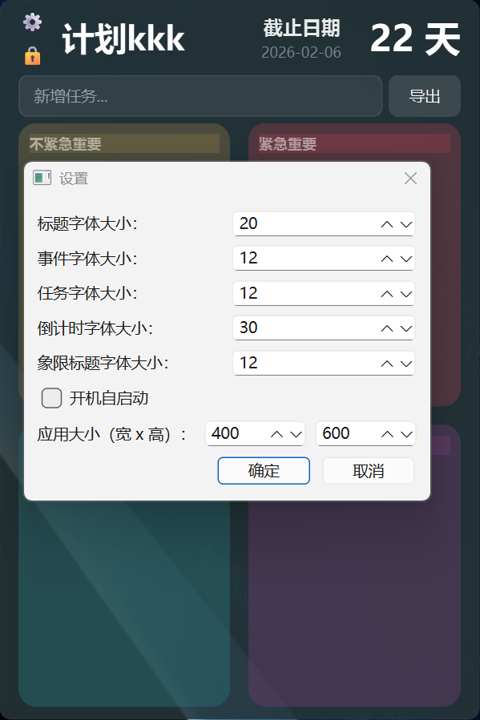

# task_list；四象限任务清单；桌面组件
四象限任务清单，桌面组件，极简功能；Four-quadrant todo list, desktop component, minimalist function

## 程序说明
这是一个桌面任务管理工具，基于艾森豪威尔矩阵（四象限法）设计，帮助您高效管理任务。

## 功能特点
- 四象限任务分类（紧急重要、不紧急重要、紧急不重要、不紧急不重要）
- 任务状态管理（完成/未完成）
- 任务拖拽排序
- 数据自动保存
- 系统托盘运行
- 倒计时功能
- 数据导出功能

## 使用方法
1. 双击运行 `四象限任务清单.exe`
2. 程序启动后会在系统托盘显示蓝色图标
3. 右键点击托盘图标可以：
   - 显示/隐藏主窗口
   - 退出程序
4. 在主窗口中：
   - 点击任务可以标记完成/未完成
   - 拖拽任务可以移动到不同象限
   - 右键任务可以删除

## 配置文件
程序会在同目录下创建 `tasks_data.json` 文件，保存所有任务数据。
如需备份或迁移，请复制此文件。

## 常见问题
1. 如果程序无法启动，请确保系统已安装：
   - Microsoft Visual C++ Redistributable (2015-2022)
   - 可以在 https://aka.ms/vs/17/release/vc_redist.x64.exe 下载

2. 如果托盘图标不显示，请检查：
   - 系统托盘设置是否隐藏了图标
   - 尝试重启程序

## 系统要求
- Windows 7/8/10/11 (64位)
- 不需要安装 Python

## 注意事项
- 请勿删除同目录下的 `tasks_data.json` 文件
- 程序关闭时会自动保存数据
- 数据导出为 CSV 格式，可用 Excel 打开

## 预览
| | |
| :---: | :---: |
|  |   |

---

版本: 1.0
发布日期: 2026
作者: gong
